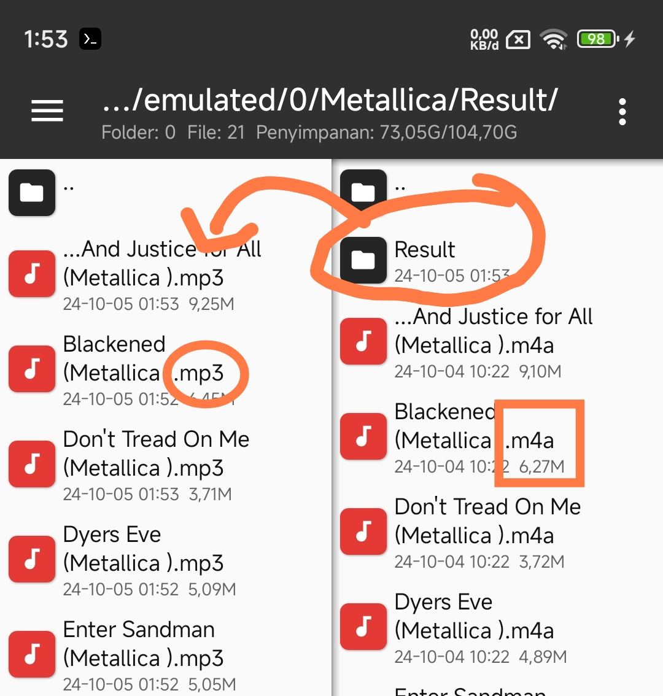

### MassConverter

It is a tool for converting media file types in bulk.

## Required
- Python
- ffmpeg

## Information

From File Folder = The place where the file will be converted 
To Folder = The place where all files will be placed or stored 
convert to Extension = The desired final result of the extension 

Example File *.m4a

The final result to *.mp3

